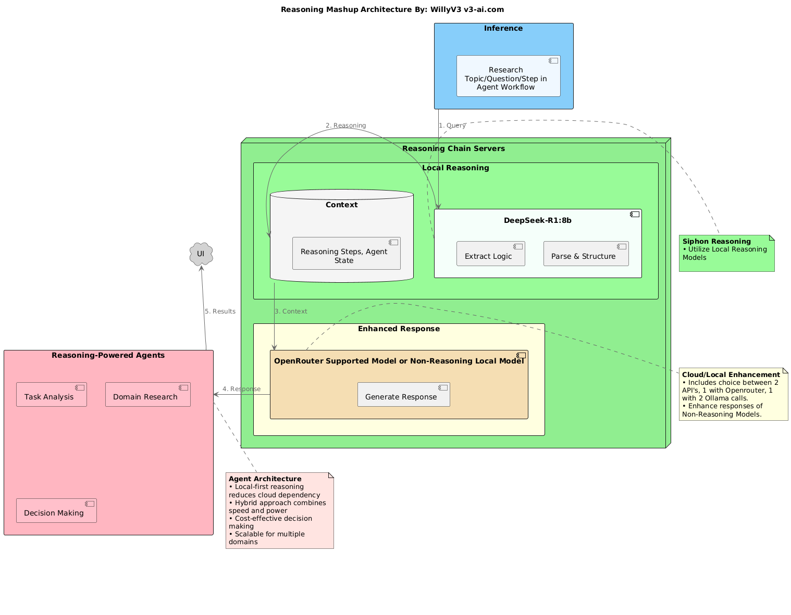

# Reasoning Mashup

A multi-agent system combining multiple LLMs for enhanced reasoning and analysis, featuring a Streamlit UI and FastAPI backend. The system implements a novel approach to reasoning by leveraging local models for initial analysis and cloud models for enhanced responses.

## Architecture



The system implements a novel reasoning chain that:
- Uses local models Reasoning Models (Currently set to 8b becuase of my Macbok, but crank it if you can!) for initial reasoning extraction
- Stores structured reasoning in a context layer
- Joins User Query with Reasoning Output and send to SOTA Model (Currently set to Claude 3.5 Sonnet, but any OpenRouter/Local Model can be used as the response LLM, Repo includes 2 API's)
- Reasoning Mashup API's can power specialized agent workflows.

Suggestions for improvements:
    -create hash on original reasoning output, Cache initial resoning output instead of reasoning on every inference. 
    


Key components:
```
├── api/                    # FastAPI backend
│   ├── main.py            # OpenRouter proxy endpoint
│   ├── main_ollama.py     # Ollama proxy endpoint
│   ├── proxy_config.py    # Proxy configuration and monitoring
│   ├── research_workflow.py    # Research analysis workflow
│   └── simple_flow.py     # Single agent workflow
├── frontend/              # Streamlit frontend
│   └── app.py            # UI implementation
├── Procfile              # Process management for development
└── setup.py              # Project dependencies and installation
```

## Setup

### Prerequisites
- Python 3.10+
- OpenRouter API key 
- Ollama with DeepSeek-R1:8b, Phi4 model pulled

### Installation

1. Clone the repository:
```bash
git clone <repository-url>
cd reasoning-mashup
```

2. Create and activate a virtual environment:
```bash
python -m venv .venv
source .venv/bin/activate  # Unix/macOS
# or
.\venv\Scripts\activate  # Windows
```

3. Install the package in development mode:
```bash
pip install -e .
```

This will install all required dependencies including:
- FastAPI and Uvicorn for the API servers
- Streamlit for the frontend
- Honcho for process management
- HTTPX for proxy support
- Other required packages

4. Set up environment variables:
```bash
# Create .env files from samples
cp .env.sample .env
cp api/.env.sample api/.env

# Update the environment variables in .env files:
# Root .env:
OPENROUTER_API_KEY=your_openrouter_key
LOGLEVEL=info  # Optional: debug, info, warning, error

# api/.env:
USE_PROXY=false  # Set to true if using mitmproxy
```

### Running the Application

The application uses Honcho for process management, allowing you to start all services with a single command:

Install Honcho:

https://formulae.brew.sh/formula/honcho

```bash
brew install honcho
```

```bash
honcho start
```

This will start:
- OpenRouter proxy server on port 8000
- Ollama proxy server on port 8001 
- Streamlit frontend

You can also start services individually:
```bash
# Start just the API servers
honcho start openrouter ollama

# Start just the frontend
honcho start frontend
```

## Components

### Reasoning Chain Implementation

The system implements a two-stage reasoning chain:

1. **Local Reasoning (DeepSeek via Ollama)**
```python
def get_deepseek_reasoning(self, user_input: str) -> tuple[str, str]:
    # Uses DeepSeek-R1:8b for initial reasoning
    # Extracts structured thinking process
    # Returns reasoning and request ID
```

2. **Enhanced Response (Claude 3 via OpenRouter)**
```python
def get_final_response(self, user_input: str, reasoning: str, model: str):
    # Uses extracted reasoning to generate enhanced response
    # Leverages more powerful model for final synthesis
    # Returns comprehensive response
```

### Proxy Configuration (`proxy_config.py`)

The system includes a flexible proxy configuration system:

```python
class ProxyMonitoring:
    """Configuration for mitmproxy monitoring"""
    MITMPROXY_URL = "http://127.0.0.1:8080"
    USE_PROXY = os.getenv("USE_PROXY", "false").lower() == "true"
    
    @staticmethod
    def get_client_config():
        # Returns proxy configuration for HTTPX clients
        # Enables mitmproxy monitoring when USE_PROXY is true
```

### ProxyAPI Integration

All workflows use a common ProxyAPI pattern for LLM interactions. 

(Use this to build new agentic workflows that use the Reasoning Mashup API's, this is how I was toggling between servers/agent workflows in Streamlit)

```python
class ProxyAPITool:
    def __init__(self, api_type: str = "openrouter", logger: Optional[Callable] = None):
        self.api_type = api_type
        self.api_url = ProxyAPIConfig.get_api_url(api_type)
        self.logger = logger or print
    
    async def execute(self, input_data: str) -> dict:
        # Configures client with proxy if enabled
        # Handles both OpenRouter and Ollama endpoints
        # Returns structured response with reasoning
```

### Streamlit UI (`frontend/app.py`)

Features:
- Workflow selection between simple and multi-agent approaches
- Real-time logging of reasoning process
- Interactive chat interface
- Debug output toggle
- Example topics/companies
- Markdown result formatting
- Stupid simple app that breaks and doesnt have good session state menegement, I didnt put a lot of effort into fiddlng with strealmit on this, its more about the backend, UI was basically just used to test everything.

## Development

### Using mitmproxy

To install mitmproxy:
```bash
pip install mitmproxy
```

https://pypi.org/project/mitmproxy/

To inspect API traffic:
1. Set `USE_PROXY=true` in api/.env
2. Start mitmproxy: `mitmproxy` (Make sure you are in the same directory as the .env file)
3. API requests will be routed through proxy (default: http://127.0.0.1:8080)

### Adding New Workflows

1. Create new workflow file in `api/`
2. Implement workflow class using ProxyAPITool pattern
3. Update `frontend/app.py` to include new workflow option
4. Add appropriate UI elements and result formatting

### Debugging

- Enable debug output in UI
- Check mitmproxy for API traffic
- Review logs in terminal windows
- Set logging level in .env:
```bash
LOGLEVEL=debug  # Options: debug, info, warning, error
```

## Contributing

1. Fork the repository
2. Create feature branch
3. Commit changes
4. Push to branch
5. Create Pull Request

## License

MIT

